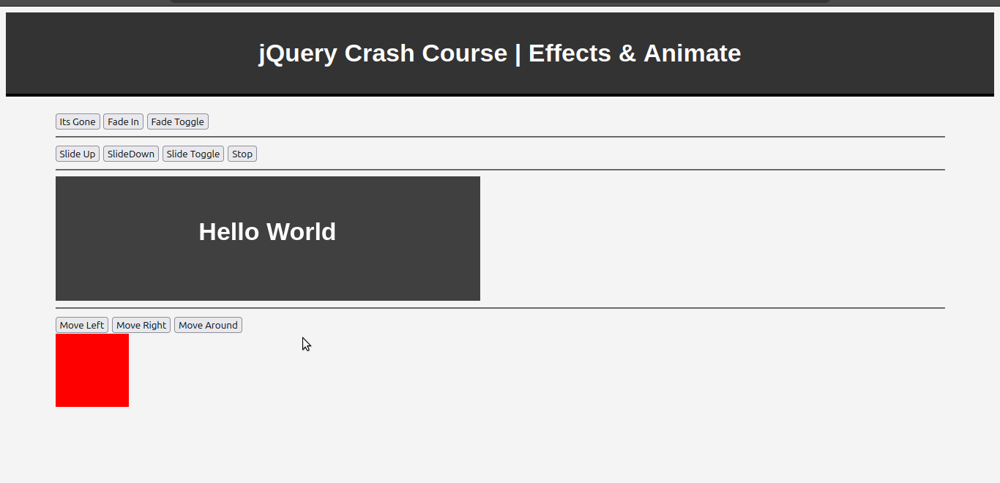

# jQuery Effects & Animation Demo (Flask)

A simple Flask application demonstrating common jQuery effects, animations, and DOM interactions.

This project was built to practice how jQuery can be used to create interactive user interfaces with animations such as fading, sliding, toggling, and custom element movement.

---

## Demo Video

🎥 Watch the complete demo here:

[](/demo.mp4)

The video demonstrates every button and animation available in the application.

---
## Features

### Fade Effects
- Fade In
- Fade Out
- Fade Toggle

### Slide Effects
- Slide Up
- Slide Down
- Slide Toggle
- Stop Animation

### Custom Animations
- Move Left
- Move Right
- Move Around

### Flask Integration
- Lightweight Flask backend
- Static assets served through Flask
- Simple project structure for learning purposes

---

## Tech Stack

- Python
- Flask
- HTML5
- CSS3
- JavaScript
- jQuery

---

## Project Structure

```text
project/
│
├── app.py
├── templates/
│   └── index.html
│
├── static/
│   ├── css/
│   ├── js/
│   └── images/
│
└── README.md
